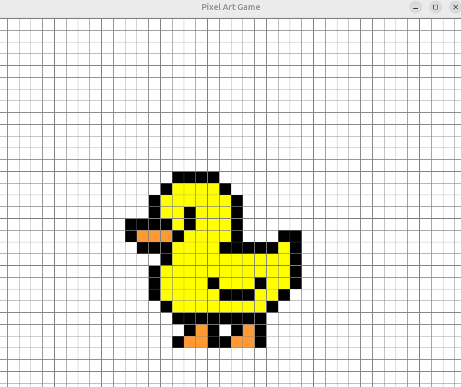
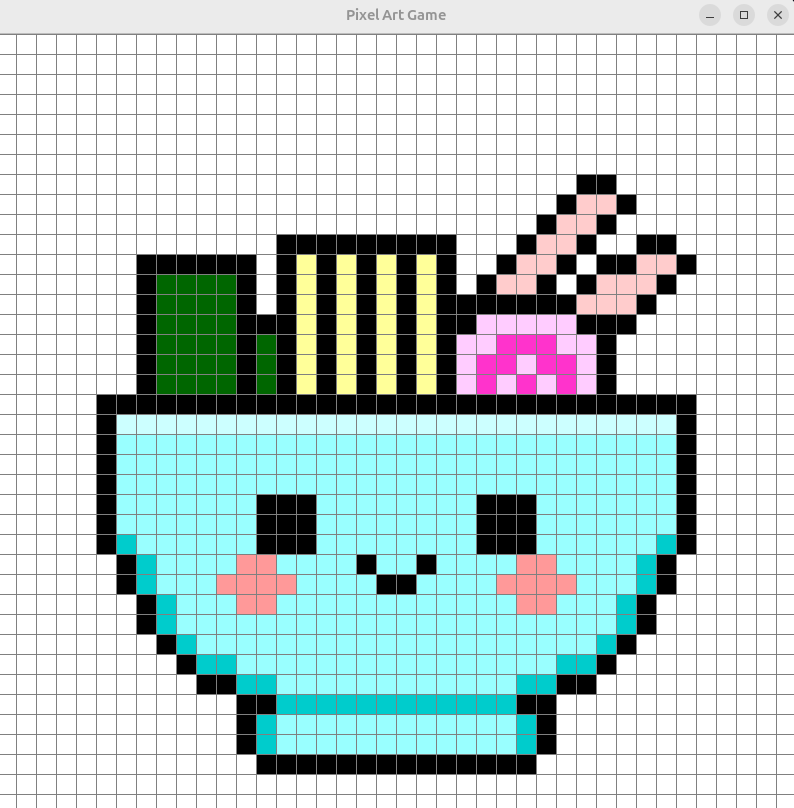
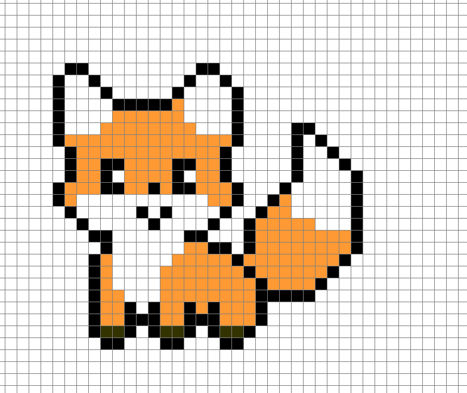
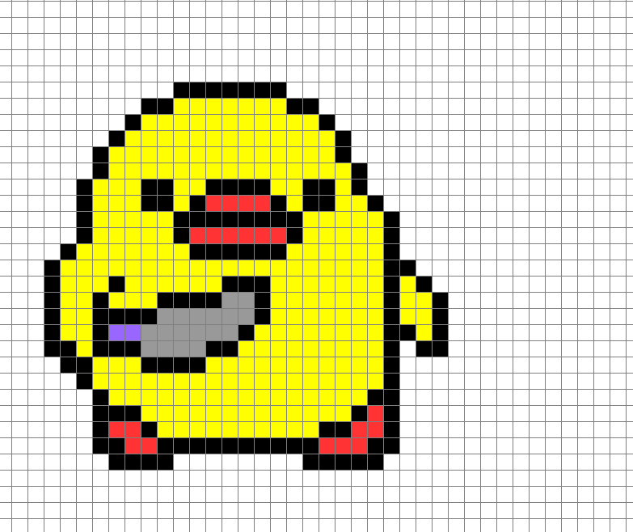

# Pixel Art Game

Jogo simples de pixel art feito em Java com Swing.

## Recursos

- Pintura de pixels com seleção de cor
- Borracha
- Exportação como imagem PNG

## Execução

Compile com:

javac -d build $(find src/br/com/pixelart -name "*.java")

Rode com:

java -cp build br.com.pixelart.Main

